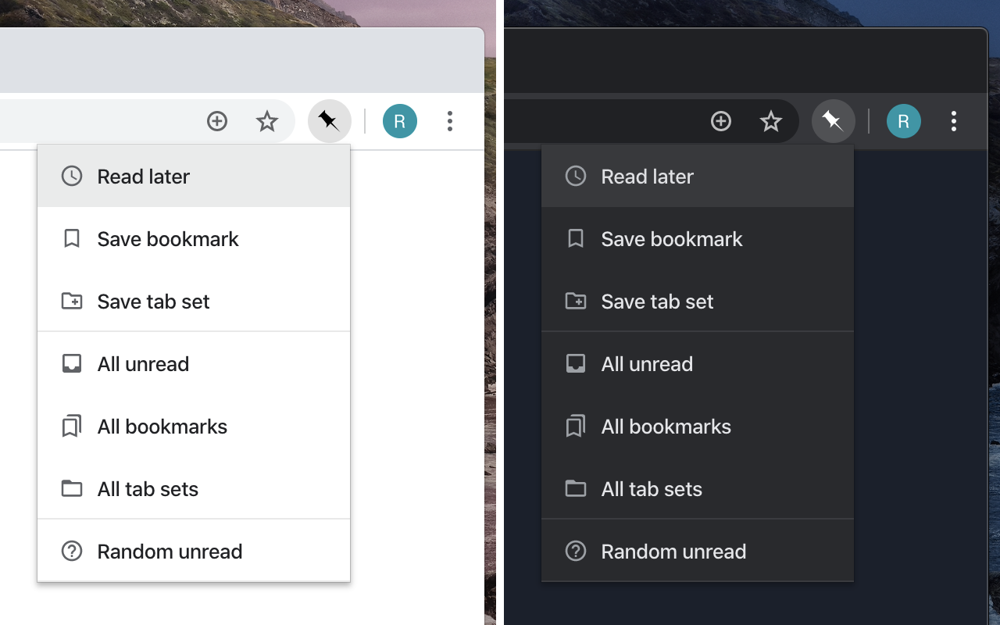

# [Pinboard Pro](https://chrome.google.com/webstore/detail/pinboard-pro/pmgaobiflaffpllgnepmhcnbdhfgnpna)

> Google Chrome extension for Pinboard.in.



## Features

- Save bookmarks
- Save for reading later
- Save tab sets
- Quick access to all your bookmarks, unread items or saved tab sets
- Open random unread item
- Dark mode
- Selected text automatically copied to description field
- Keyboard shortcuts (customizable)
- Fully customizable menu
- Does not store login information

The _"Save bookmark"_-dialog uses the official popup which means you have access
to all your tags and tag suggestions.

## Install

Install from [Chrome Web Store](https://chrome.google.com/webstore/detail/pinboard-pro/pmgaobiflaffpllgnepmhcnbdhfgnpna).

## Development

Install dependencies:

```bash
$ yarn
```

Build extension:

```bash
$ yarn build
```

## License

MIT &copy; [Richard Käll](https://richardkall.se)
