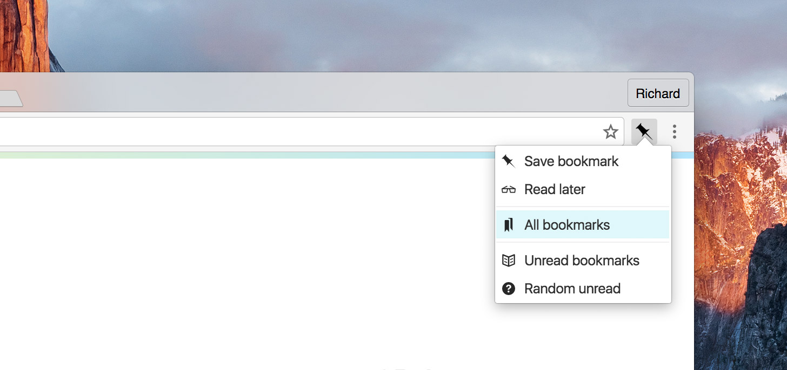

# Pinboard Pro [](https://travis-ci.org/richardkall/pinboard-pro-chrome-extension)

> Google Chrome extension for Pinboard.in (https://pinboard.in).



## Features

- Save new bookmarks
- Quick-save for reading later
- Selected text automatically copied to description field
- Keyboard shortcuts (customizable)
- Customizable menu
- Access all your bookmarks or unread only
- Quick access to a random unread item
- Does not store login information
- Mac OS X only: uses the new beautiful San Francisco font!

The "Save bookmark"-dialog uses the official popup which means you have access to all your tags and tag suggestions.

## Install

Install from [Chrome Web Store](https://chrome.google.com/webstore/detail/pinboard-pro/pmgaobiflaffpllgnepmhcnbdhfgnpna).

## Development

Install dependencies:

```bash
$ npm install
```

Build extension:

```bash
$ npm run build
```

## License

MIT &copy; [Richard Käll](http://richardkall.se)
